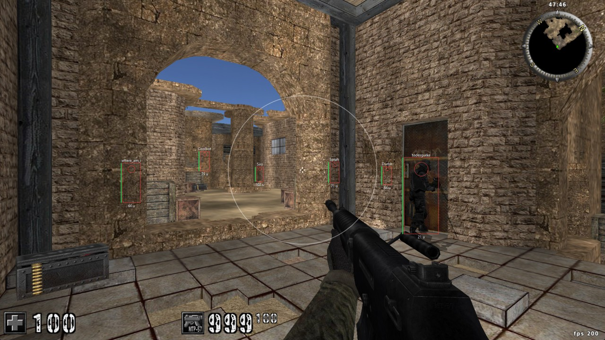
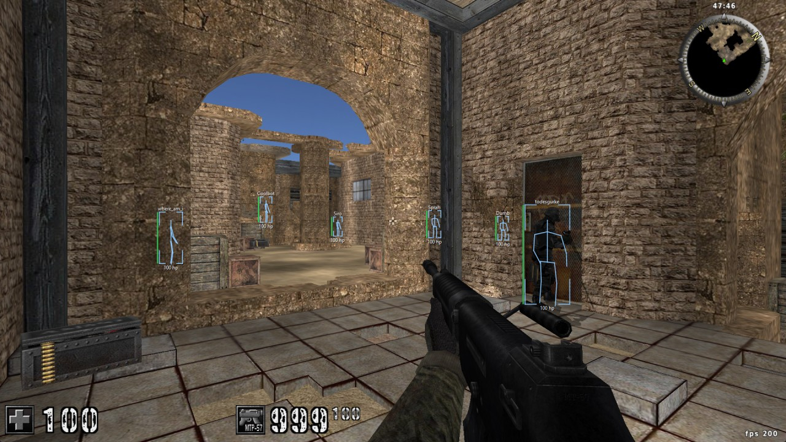
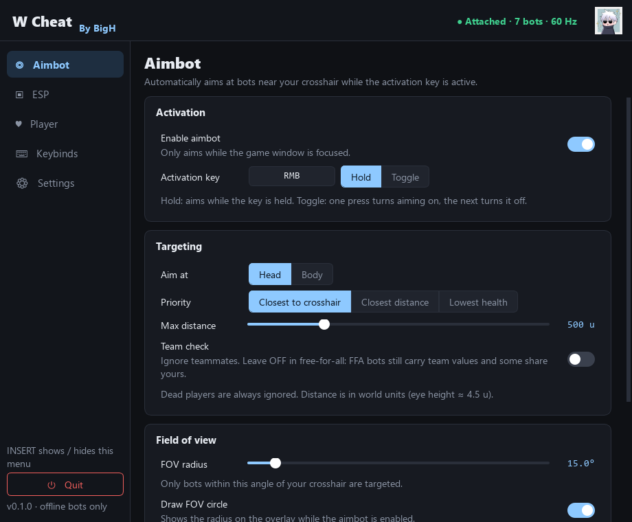
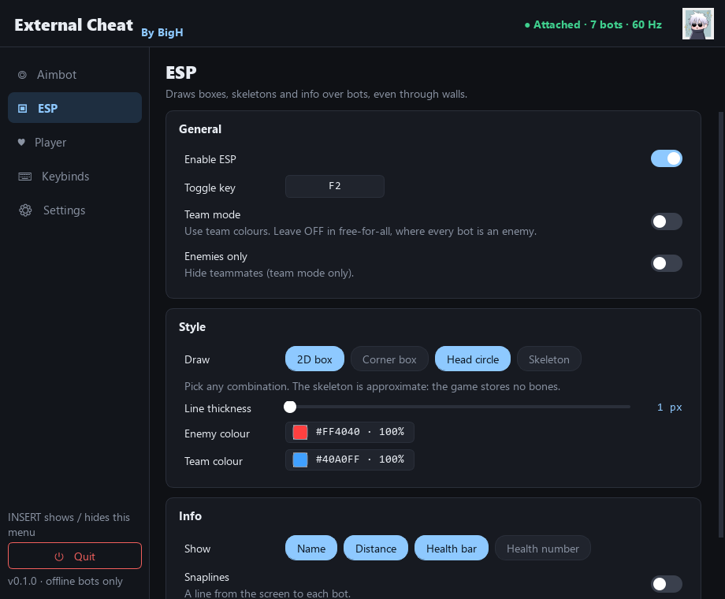
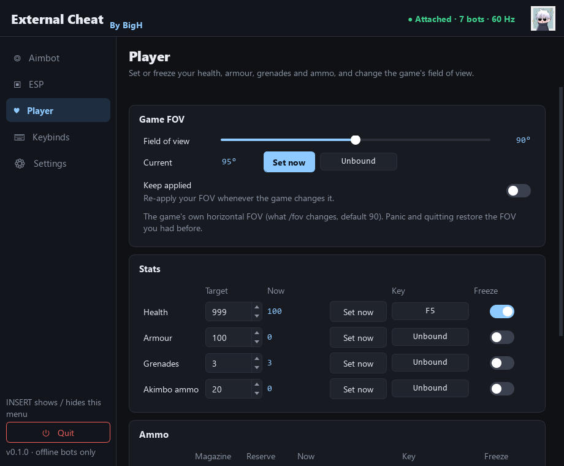
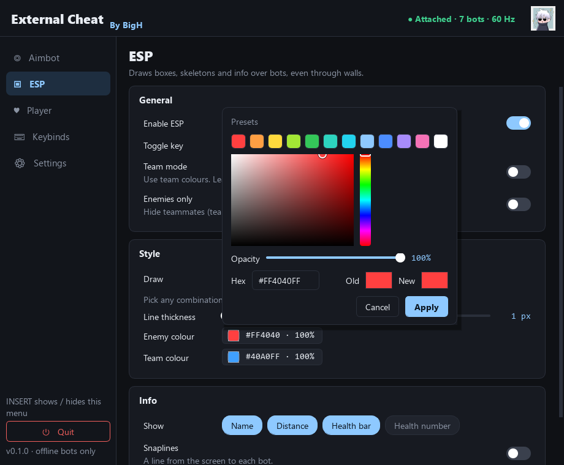
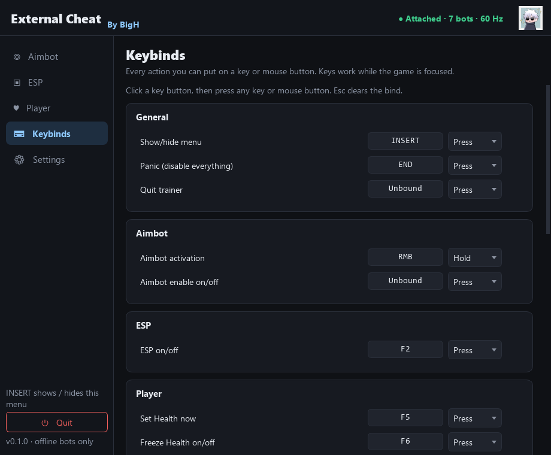
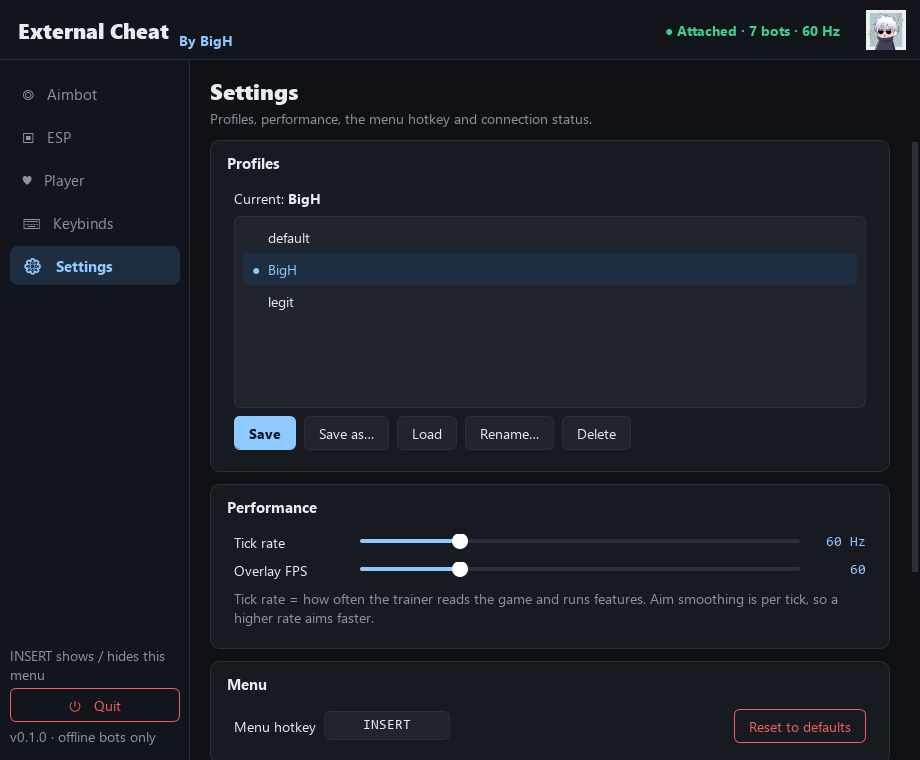

<p align="center">
  
</p>

<h1 align="center">W Cheat</h1>

<p align="center">
  <b>By BigH</b><br>
  External trainer for AssaultCube 1.3.0.2, written in Python<br>
  <sub>Personal learning project · offline bot matches only</sub>
</p>

---

A personal learning project: an external trainer for **AssaultCube 1.3.0.2**, written in Python.
It covers process memory, pointer chains, vector maths, world-to-screen projection, and building a
PyQt5 desktop app with a settings menu and a transparent overlay.

> **Scope:** offline, single-player bot matches on my own PC only. No online use, no anti-cheat
> bypasses or evasion, no injection or DLLs, no network code, no distribution.

## Screenshots

<p align="center">
  
  <br><sub><b>ESP:</b> 2D boxes, head circles, names, health bars, distance and the aimbot FOV circle (bots seen through walls)</sub>
</p>

<p align="center">
  
  <br><sub><b>ESP:</b> corner boxes, approximate skeletons and health numbers in a custom colour</sub>
</p>

<table>
  <tr>
    <td align="center" width="50%"><br><sub><b>Aimbot</b>: key and mode, targeting, FOV, smoothing</sub></td>
    <td align="center" width="50%"><br><sub><b>ESP</b>: styles, colours and info</sub></td>
  </tr>
  <tr>
    <td align="center"><br><sub><b>Player</b>: game FOV, set/freeze values with live readouts</sub></td>
    <td align="center"><br><sub><b>Colour picker</b>: presets, custom colour, opacity, live preview</sub></td>
  </tr>
  <tr>
    <td align="center"><br><sub><b>Keybinds</b>: every action, any key or mouse button</sub></td>
    <td align="center"><br><sub><b>Settings</b>: profiles, performance, live status</sub></td>
  </tr>
</table>

<sub>Screenshots are regenerated with <code>tools\readme_shots_game.py</code> and <code>tools\readme_shots_menu.py</code>.
The ESP images are the game with the overlay's own drawing applied, captured with the same painter the overlay uses.</sub>

## Features
- **Menu:** dark PyQt5 window with sidebar navigation, toggle switches and an ice-blue accent, toggled with **INSERT**.
  Every change applies live. Profiles use explicit Save.
- **Aimbot:** hold/toggle key, head/body, priority (crosshair / distance / lowest health), FOV radius + circle,
  smoothing, team check, max distance. Only aims while the game window is focused.
- **ESP overlay:** 2D box, corner box, head circle, approximate skeleton (combinable); name, health bar, health number,
  distance, snaplines; team mode; colours (picker with presets, custom colour, opacity, live preview) and line
  thickness. Transparent and click-through.
- **Player values:** health, armour, grenades, akimbo, and magazine/reserve ammo per weapon. Each has Set now, Freeze
  and an optional hotkey, plus a live in-game readout.
- **Game FOV:** change the game's own field of view (30–150°), set once or keep applied.
- **Keybinds:** every action is bindable to a keyboard key or mouse button, in hold / toggle / press mode, with conflict warnings.
- **Panic (END):** instantly disables everything, unfreezes all values and restores your original FOV.

## Requirements
- Windows, Python 3.11+
- AssaultCube 1.3.0.2, running **windowed or borderless** (the overlay can't draw over exclusive fullscreen)

## Install
```powershell
python -m pip install -r requirements.txt
python -m pip install -e .
```

## Run
1. Start AssaultCube and begin an **offline bot match**.
2. Run `python -m actrainer`. The menu opens, and the header shows **● Attached · N bots · 60 Hz**.
   Pick a section in the left sidebar.
3. Press **INSERT** to hide or show the menu at any time, including from inside the game.

The trainer can be started before the game. It attaches automatically within about a second of the game starting, and
reattaches if the game is restarted. Logs go to the console and to `logs\actrainer.log`.

## Using the menu
| Page | What's there |
|---|---|
| **Aimbot** | Enable, activation key and mode (default: hold **right mouse button**), aim at head/body, priority, max distance, team check (leave off in free-for-all), FOV radius + "draw FOV circle", smoothing (1 = instant snap) |
| **ESP** | Enable, toggle key, team mode (off for free-for-all), enemies only, styles (click the chips to combine), line thickness, enemy/team colours, info extras, snapline origin |
| **Player** | Game FOV (slider, Set now, Keep applied); stats and ammo, each with target, live "Now" value, Set now, key and Freeze |
| **Keybinds** | Every bindable action. Click a key button, then press any key or mouse button; **Esc** clears. Conflicts show in red, and the sidebar entry gets a ⚠ |
| **Settings** | Profiles (Save / Save as / Load / Rename / Delete), Reset to defaults, tick rate, overlay FPS, menu hotkey, status panel |

### Choosing colours
Click any colour chip (e.g. **#FF4040 · 100%**) to open the picker:
- **Presets:** one click; your current opacity is kept.
- **Colour square + hue bar:** for any custom colour.
- **Opacity:** slider in %. The swatches sit on a checkerboard so you can see transparency.
- **Hex:** type `#RRGGBB` or `#RRGGBBAA`.

The colour applies **live** while the picker is open, so you can judge it on real bots. **Apply** (or clicking outside)
keeps it; **Cancel** or **Esc** puts the old colour back. Click **Old** to jump back to the original.

### Default hotkeys
| Key | Action |
|---|---|
| INSERT | Show / hide the menu |
| END | Panic: disable everything, unfreeze values, restore FOV |
| Right mouse (hold) | Aimbot (when enabled) |

Everything else is unbound by default. Bind what you like on the Keybinds tab.

### Profiles
- Changes apply immediately but are only saved when you click **Save**. A `*` in the title means unsaved changes.
- `default` is read-only: use **Save as** to create your own. The last profile you used loads automatically on startup.
- Profiles are readable JSON files in `profiles\`. If one contains invalid values, they're reset or clamped and you're told which.

## Troubleshooting
| Problem | Fix |
|---|---|
| "Not attached" | Start AssaultCube. If the game runs as administrator, run the trainer as administrator too. |
| "Attached · not in a match" | Start or join an offline bot match. The main menu has no player to read. |
| Menu not clickable when it pops up | Press Esc in-game to free the cursor, then INSERT again. |
| No overlay | Run the game windowed or borderless, enable ESP, and keep the game (or the menu) focused. |
| ESP boxes offset | Check Windows display scaling isn't overriding DPI for Python. Run `python tools\phase8_view_matrix.py`: it should say `OK`. |
| "W Cheat is already running" | Another copy is open. Use INSERT to find its menu, or quit it. |
| After a game update | Run `tools\phase1_local_player.py`, `phase2_entities.py` and `phase8_view_matrix.py` to check the offsets still work. |

## Debug tools
Small read-only scripts in `tools\`, one per build phase. Each prints live values from the game:
`phase1_local_player.py`, `phase1_dead_diag.py`, `phase2_entities.py`, `phase3_angles_check.py`, `phase4_keybinds.py`,
`phase8_view_matrix.py`.
README screenshots: `readme_shots_game.py` (game + ESP) and `readme_shots_menu.py` (menu pages).

## Tests
```powershell
python -m pytest
```
316 tests cover the maths, settings/profiles, keybinds, aimbot, ESP, player values, controller and UI. They need no game
and open no windows.

## Project docs
- `CLAUDE.md`: architecture, rules, offsets, gotchas, decision log and status (the project's memory).
- `docs\DEVLOG.md`: dated build log, including the bugs found and how they were fixed.


---

## How it works (the educational part)

This project was built to learn how a game stores its world in memory, and how to turn that data into an aimbot
and an ESP overlay with some vector maths. This section walks through each piece, using the real numbers from
AssaultCube 1.3.0.2. File links point to where each idea lives in the code.

### 1. Reading another program's memory

Every running program has its own private address space. Windows lets a program with the right permissions open
another process and read or write its memory with `ReadProcessMemory` / `WriteProcessMemory`. This project does
that through [`pymem`](https://github.com/srounet/Pymem), wrapped in
[`memory/process.py`](src/actrainer/memory/process.py). It's *external*: nothing is injected into the game.

**Module base.** The game's code and global variables live in `ac_client.exe`, which Windows loads at a base address
(here `0x00400000`). Every static address in [`offsets.py`](src/actrainer/offsets.py) is an offset from that base.

**Pointers and 32-bit.** AssaultCube is a 32-bit program, so a pointer is **4 bytes**, even though our Python is
64-bit. Reading a pointer as 8 bytes would glue two values together and break everything after it, so every read
uses an explicit size (`struct` format `<I` = little-endian unsigned 32-bit).

**Pointer chains.** Players are created at runtime, so their addresses change every match. The game keeps a
*static* variable that *points* to the local player, so we follow it:

```
module base + 0x18AC00  ──read 4 bytes──►  0x009DD2C8   (address of the local player struct)
0x009DD2C8  + 0xEC      ──read 4 bytes──►  100          (health)
```

**Structs.** A player is a C++ object: a block of bytes where each field sits at a fixed offset (head position at
`0x04`, yaw at `0x34`, health at `0xEC`, name at `0x205`...). Instead of ~20 separate cross-process reads, the
trainer reads the whole 0x31C-byte block **once** and unpacks the fields locally
([`game/player.py`](src/actrainer/game/player.py)).

**The entity list.** The game has `vector<playerent*> players`: a pointer to an array of player pointers, plus a
count. Slot 0 is empty (it stands for you). Every other slot is a bot, as long as the pointer is valid and the data
passes sanity checks: finite positions, a believable health value. One garbage entry is skipped, never fatal
([`game/entities.py`](src/actrainer/game/entities.py)).

**Finding offsets: a real bug from this project.** The original local-player offset `0x17E0A8` worked perfectly...
until you died. Then `dead` stayed `0` and the name came back empty. A diagnostic that saved the player struct
**alive → dead → alive** and compared the bytes showed the *pointer itself* changed on death, and the "player" data
contained the text `packages\models\weapons\grenade\static\shadows.dat`. It was really the game's **camera**
pointer (`camera1`), which switches to a death-cam object when you die. Scanning the game's static memory for
every slot holding the player's address found `0x18AC00`, sitting right before the entity list. That's
`playerent *player1;` declared next to `vector<playerent*> players;` in the source. Lesson: values that are
"right most of the time" can still be the wrong variable, so compare states (alive/dead) to find out.

### 2. The aimbot

Each tick (60 per second by default) the aimbot works out which way you'd need to look to face a bot's head,
then turns your view towards it ([`features/aimbot.py`](src/actrainer/features/aimbot.py),
[`maths/angles.py`](src/actrainer/maths/angles.py)).

**Angles from a direction.** Subtract positions to get the vector from your eye to the target:
`d = target - eye`. Then:

```
pitch = atan2(d.z, sqrt(d.x² + d.y²))     # up/down: height difference vs. horizontal distance
yaw   = atan2(d.x, -d.y)                  # left/right, in AssaultCube's convention
      = atan2(d.y, d.x) + 90°              # same thing written the "standard" way
```

**Why +90°?** Standard maths measures angles from the +x axis. AssaultCube measures yaw from the **−y** axis. This
was derived from the game's own `vecfromyawpitch()`, which builds the facing direction as
`(sin yaw · cos pitch, −cos yaw · cos pitch, sin pitch)`, and checked with unit tests. Yaw is kept in 0–360°,
pitch is clamped to ±90°.

**Picking a target.** For every live bot the aimbot works out:
- **Angle from your crosshair:** the *true* angle between two view directions, from the dot product
  `angle = acos(dir₁ · dir₂)`. Simply subtracting yaws breaks down when you look straight up, where a 180° yaw
  difference is really only a couple of degrees.
- **Distance:** `|d|`.

Bots outside the FOV radius or max distance, dead bots and (if team check is on) teammates are dropped. The rest are
sorted by your priority: closest to crosshair, closest distance or lowest health.

**Smoothing.** Snapping instantly looks robotic. Each tick the view moves `1 / smoothing` of the remaining angle, so
it eases in quickly at first and slows down as it arrives:

```
new = current + (target - current) / smoothing      # smoothing 1 = instant snap
```

Yaw has a catch: going from 350° to 10° is a **20°** turn through 0, not −340°. The difference is wrapped into
(−180°, 180°] first, so the view always takes the short way round.

**Writing the result.** Yaw (`0x34`) and pitch (`0x38`) sit next to each other, so both are written in one 8-byte
write. The game never sees a new yaw paired with an old pitch. As a safety rule the aimbot only runs while the game
window is focused, so holding the key over the menu never moves your view.

### 3. The ESP: turning 3D positions into screen pixels

To draw a box around a bot you need to know where its head and feet appear **on your screen**. The game already
works this out every frame to render the world, using a 4×4 **view-projection matrix** that it keeps in memory
(`0x17DFD0`, 16 floats). We read the same matrix and do the same maths
([`maths/projection.py`](src/actrainer/maths/projection.py)).

**Step 1: world → clip space.** Multiply the point `(x, y, z, 1)` by the matrix. OpenGL stores matrices
**column-major**, so element (row r, column c) is at index `c*4 + r`:

```
clip_x = m[0]·x + m[4]·y + m[8]·z  + m[12]
clip_y = m[1]·x + m[5]·y + m[9]·z  + m[13]
clip_w = m[3]·x + m[7]·y + m[11]·z + m[15]      # ≈ how far in front of the camera the point is
```

**Step 2: behind the camera?** If `clip_w` is tiny or negative, the point is behind you. Dividing by it would
mirror the point onto the screen, so it's skipped.

**Step 3: perspective divide.** Far things look smaller because everything is divided by distance:
`ndc = (clip_x / clip_w, clip_y / clip_w)`, giving values from −1 to 1 across the screen.

**Step 4: to pixels.** Screen y grows **downwards** but NDC y grows upwards, so y is flipped:

```
screen_x = (ndc_x + 1) / 2 · width
screen_y = (1 - ndc_y) / 2 · height
```

**Proving it's right.** A point placed straight along your own view direction must land in the exact centre of the
screen. On a 1920×1080 game window it lands at **(960.0, 540.0)**. That one check confirms the matrix address, the
column-major layout and the yaw/pitch maths all agree
([`tools/phase8_view_matrix.py`](tools/phase8_view_matrix.py)).

**From two points to a box.** Project the feet and the top of the head (the stored head position is the *eye*, so
0.8 units are added). The vertical distance between them is the box height, and the width is 45% of that, roughly
a person's proportions ([`features/esp.py`](src/actrainer/features/esp.py)).

**The skeleton.** The game stores no bone data, so the stick figure is *approximated*: joints sit at fixed fractions
of the player's height (neck 86%, shoulders 82%, hips 50%, knees 26%), offset sideways along the player's facing
direction, then each joint is projected like any other point ([`maths/skeleton.py`](src/actrainer/maths/skeleton.py)).
A bug the tests caught: AssaultCube's world is **left-handed**, so "right" is `up × forward`. The usual
`forward × up` put the arms on the wrong side.

**The FOV circle.** A ray at angle `a` from the centre of a perspective view lands
`tan(a) / tan(hfov / 2) · width / 2` pixels from the centre. So the aimbot's FOV radius (in degrees) becomes a circle
radius in pixels. Reading the matrix showed the game's FOV is **horizontal**: its x scale is exactly
`1 / tan(90° / 2) = 1.0`.

**The overlay window.** The drawing happens in a separate window that covers the game
([`overlay/window.py`](src/actrainer/overlay/window.py)):
- **Frameless, transparent and always on top**, sized to the game's *client area* (the picture, without the title bar).
- **Click-through:** Qt's `WA_TransparentForMouseEvents` only affects Qt. Windows itself also needs the
  `WS_EX_LAYERED | WS_EX_TRANSPARENT` styles, or clicks would hit the overlay instead of the game.
- **DPI aware:** without it, Windows scales the window on high-DPI screens and every box is drawn in the wrong place.

The ESP code only produces a list of shapes (lines, rectangles, circles, text). The overlay just paints them. That
split is what made it possible to unit-test the ESP without a game or a window.

### 4. Player values and freezing

Setting health is a single 4-byte write to `player + 0xEC`. **Freeze** is the same write repeated every tick, but
only when the value differs, so it costs nothing while the value is already right
([`features/player_values.py`](src/actrainer/features/player_values.py)). Two details came from testing:
- **Health goes negative when you die** (−54 was observed), so "alive" comes from the `dead` flag, never `health > 0`.
- **The trainer can set health to 999**, so it can't treat "health 0–100" as proof that the player data is valid.
  Position sanity checks are used instead.

### 5. How it all fits together

```
           settings  ◄──── menu (edits settings only, never touches memory)
              │
              ▼
 game memory ─► read local player, bots, view matrix ─► aimbot ─────────► write view angles
                                                     ├► player values ──► write health / ammo
                                                     └► ESP ─► shapes ──► overlay window
 keyboard / mouse ─► keybind engine (hold / toggle / press) ─► turns features on and off
```

A timer runs this loop 60 times a second ([`app/controller.py`](src/actrainer/app/controller.py)). If a read fails
(the game is loading, or it closed), the tick is skipped and the trainer reattaches when the game comes back, so
nothing crashes. The maths, aimbot and ESP are pure functions with no memory access and no windows. That's why most
of the 316 tests run without the game at all.

### Want to dig deeper?
- [`docs/DEVLOG.md`](docs/DEVLOG.md) is the full build diary, including every bug and how it was tracked down.
- [`CLAUDE.md`](CLAUDE.md) has the architecture, the offset table and a long list of gotchas.
- The `tools/` scripts print live values from the game, one per build step, so you can watch each piece working on
  its own.
